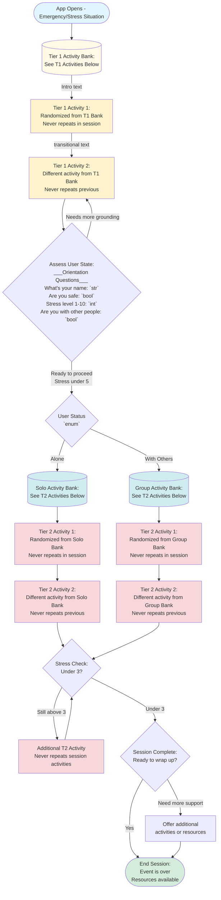

# CALMe Crisis Intervention App

*Complete Flow Chart & Activity Banks Reference*

## Flow Chart

## Activity Banks

### 🟡 TIER 1 ACTIVITIES

**Orientation & Grounding - Bring User to Present Moment**

#### Stage 1: Simple Deflection Activities

*Quick engagement before beginning Ma'asei model*

##### Visual/Perception Tasks

- Drawing or copying shapes
- Color blending recognition (e.g., "Yellow + Blue = ?")
- Finding four square objects in the environment
- Match colors (without memory component)
- Recaptcha-style questions (e.g., "How many rocks do you see?")

##### More Complex T1 Activities

- Matching/Memory Card Game
- Breathing Module (guided breathing exercises)

#### Stage 2: Orientation Questions

*Assess situation and ability to communicate*

##### Identity & Awareness

- Who are you?
- Where are you?
- What day is it?
- Generic awareness questions
- Simple math questions

##### Critical Path-Determining Questions

- **Are you with other people?** (Don't use "alone" - rephrase positively)
  → Determines Solo vs. Group activity path
- **Stress level assessment (1-10 scale)**
  → Determines capability and willingness to act

##### Additional Assessment

- Age range/ability assessment
- Physical space available? (Do you have a lot of space?)

> **Key Principle:** T1 activities are never repeated in the same session. Use randomization to ensure variety.

---

### 🔴 TIER 2 ACTIVITIES

**Engagement & Meaningful Action - Give Purpose**

#### Stage 3A: Activities WITH OTHERS GROUP PATH

*Provide meaning through helping/connecting with others*

##### Social Awareness

- Count how many people are with you
- Who is with you? Learn their names

##### Helping Activities

- Can you make sure everyone has water?
- Does everyone have room in the safe space? Can you do something to make more room?

#### Stage 3B: Activities ALONE SOLO PATH

*Give meaning without requiring others present*

##### Communication Activities

- Are you able to text or call someone?
- Write a letter to someone important to you
- Make a card for someone

> **Note from Matan:** Stretches don't give meaning/impact to others, so they're harder to motivate people to complete. Activities should provide a sense of purpose or connection.

#### Stress Level Check Logic

- **If stress level is NOT under 3:** Loop back to T2 activities (new ones, never repeat)
- **If stress level IS under 3:** Move to wrap-up phase

#### Wrap-Up Phase

*"From confusion to understanding - the event is over"*

- Transition activities to help user recognize emergency has passed
- *(Specific activities to be determined)*

> **Key Principle:** T2 activities are never repeated in the same session. Choose from appropriate bank (Solo or Group) based on T1 assessment.

---

## 🎯 Core Design Principles

- **Randomization:** Use randomization for activities to ensure uniqueness each time app opens
- **No Repeats:** Activities never repeat within the same session
- **Path-Based:** Different activity banks for Solo vs. Group situations
- **Meaningful Action:** Focus on activities that provide purpose and connection
- **Progressive Engagement:** Move from deflection → orientation → meaningful action
- **Stress Assessment:** Check stress levels to determine if more T2 activities needed
- **Fresh Each Time:** No persistent memory between sessions - gather fresh information each time

---

*CALMe Project | Crisis Intervention App Based on Ma'asei Model*

*Last Updated: November 10, 2025*

